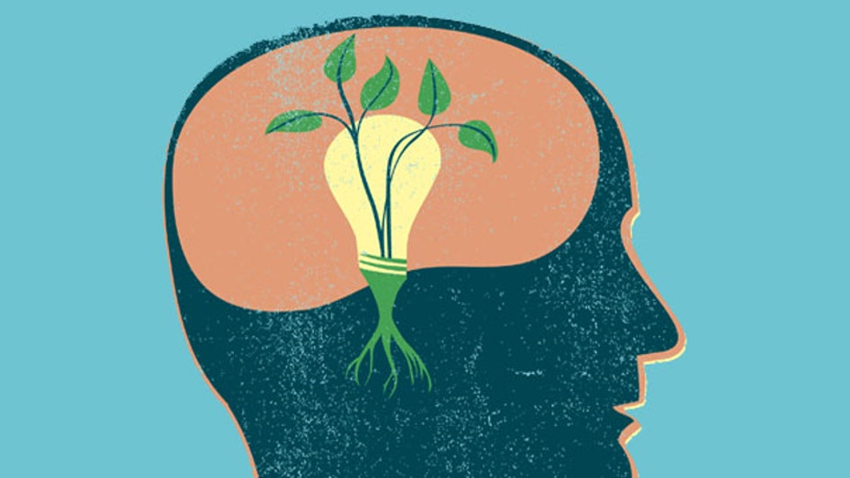

# growth mindset
------------
referance **[`link`](https://www.atlassian.com/blog/inside-atlassian/growth-mindset "www.atlassian.com")**

____
>**_growth mindset_** it's a way of thinking that brings the most potential out of any abilities the person wants to have. while fixed mindset stops the person from bringing out the most abilities to the table and restricts it within a boundary.

 ## Here are tips on how to have a growth mindset :
- [x] facing a challenge   
when git status a challenge never avoid it , step back , look for new ways to slove the problem always try to think in outloud and jot down the clues ,dont think just inside your head
- [x] facing an obstacle 
so when you are doing some tasks and suddenly started to jump through taps and images while losing focus, it suggests that to put down whatever you are doing and wake away and return when you feel inspired.
- [x] facing effort
so when you go through a tough challenge there are two decisions to make one setback or the other to move forward, always make a conscious effort to stop and think about the growth mindset. ask is it worth to stop or should you continoue.

> short-term frustration will likely result in long-term improvement of my abilities.
> 
> A growth mindset means creativity and possibility, makes the one to achieve more and set higher goals.

